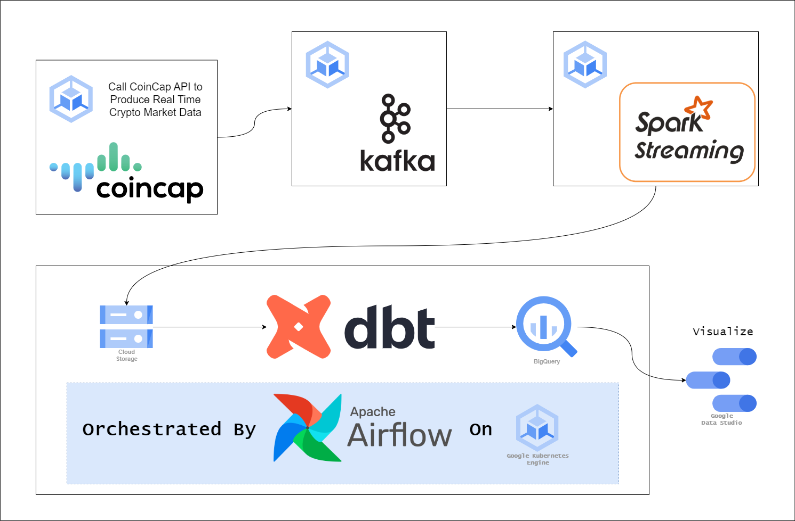

# End to End Streaming Data Pipeline

The aim of this project is to create an end to end data pipeline in the cloud (GCP) leveraging Apache Kafka and Spark Streaming.

Stream data source is taken from [CoinCap API](https://docs.coincap.io/).

Target pipeline structure :



## Current Progress

- Run kafka and other services using `docker compose`
  
  ```bash
  cd kafka
  docker compose up -d
  ```

- Create topic `topic_BTC` and `topic_ETH` through confluent UI (control-center).

- Created Data Producer and Dockerizing it, then connecting it to Kafka.

  ```bash
  cd data_producer
  docker build -t data_producer:0.0.1 .
  docker run -itd --network=<kafka_container_network> data_producer:0.0.1
  ```

## TODO

- Automate topic creation at startup of kafka image.
- Parametrize data producer.
- Create container for spark streaming (data consumer).
- Create deployment manifests for all the images.
- Spin up GCP resources using Terraform.
- Deploy all images to Google Kubernetes Engine and configure connection for each clusters.
- Deploy Airflow + dbt on GKE.
- Create DAG for the ETL pipelines.
- Visualize data in Google Data Studio.